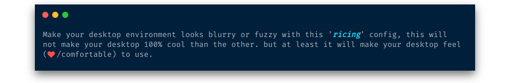

     
        
     

<h1 align='center'>
    <b>Ngeblur Desktop</b>
</h1>

    <i>Blur plus transparent depicts the <b><u>nuances of serenity</u></b>, right? eh? (ah whatever)</i>

    
    
    
    

 

    <i>(<b>Current language:</b> :us: English | <a href="../../README.md">Go back?</a>)</i>

**Recommended:** better to use fresh install, and _without desktop environment_.

    
<b>Show system details</b>

    <ul>
        <li><b>OS</b>: Arch Linux / Others</li>
        <li><b>Shell</b>: (oh-my) zsh</li>
        <li><b>Windows Manager</b>: i3 (gaps-next)</li>
        <li><b>Compositor</b>: compton (<i>AUR: <a href="https://aur.archlinux.org/packages/compton-tryone-git/">compton-tryone-git</a></i>)</li>
        <li><b>Status Bar</b>: polybar</li>
        <li><b>Color Scheme</b>: pywal (<i>AUR: <a href="https://aur.archlinux.org/packages/wpgtk-git/">wpgtk-git</a></i>)</li>
        <li><b>Terminal</b>: urxvt (<i>AUR: <a href="https://aur.archlinux.org/packages/rxvt-unicode-cvs-patched-wideglyphs/">rxvt-unicode-cvs-patched-wideglyphs</a></i>)</li>
        <li><b>File Manager</b>: Nemo for GUI, Ranger for CLI</li>
        <li><b>Launcher</b>: Rofi</li>
        <li><b>Editor</b>: Vim, VSCode</li>
        <li><b>Browser</b>: Chromium</li>
        <li><b>GTK Theme</b>: (Default <a href="https://aur.archlinux.org/packages/wpgtk-git/">wpgtk-git</a>: FlatColor)</li>
        <li><b>Icon Theme</b>: (Default <a href="https://aur.archlinux.org/packages/wpgtk-git/">wpgtk-git</a>: flattrcolor-dark)</li>
        <li><b>Wallpaper</b>: (See in directory: <a href="../../.wallpaper">.wallpaper/</a>)</li>
    </ul>

## Table of Contents

+ [What is Ricing?](#what-is-ricing)
+ [Before continuing!](#before-continuing)
+ [Features and a few screenshot](#features-and-a-few-screenshot)
+ [Getting started](#getting-started)
  + [Prerequisites](#prerequisites)
  + [Dependencies](#dependencies)
  + [Fonts](#fonts)
  + [Installation](#installation)
+ [Advanced Topics](#advanced-topics)
  + [Uninstalling](#uninstalling)
  + [Needs to configure](#needs-to-configure)
  + [Keybinds](#keybinds)
  + [Tips / Notes](#tips--notes)
+ [Acknowledgements](#acknowledgements)
+ [How can I support the developer?](#how-can-I-support-the-developer)
+ [License](#license)

## What is Ricing?

[(Back to top)](#table-of-contents)

There are some opinions about the beginning of the word ricing, the most famous of which starts from the word "**Race Inspired Cosmetic Enhancement (_RICE_)**", a contest to beautify a car by adding lots of accessories without caring about the engine which in the end won't make a meaningful difference except only from the appearance. In the end, ***Making improvements to a system that don't actually do anyone any good, and can sometimes have negative/positive ramifications.***

> **Summary**: The essence of ricing is to change the look in such a way as to find comfort in using linux as a daily work tool. sometimes simpler is better for performance otherwise, lot of decoration will slows down performance

Okay, that's a brief explanation of the definition of **'_ricing_'**, hopefully you understand at this point, if the short explanation above is not enough to understand, please find more details on the internet

## Before continuing!

[(Back to top)](#table-of-contents)

***I want to emphasize here so that there are no further misunderstandings***, there's are <u>several configurations and <b>'<i>ricing</i>'</b> that are not entirely made by me</u> but made by someone else. all I do is re-modify it to fit what I want, the rest is created by my own.

So I will put the [Acknowledgements](#acknowledgements) of someone else's work below along with the source link as a symbol of respecting other people's work.

If any of your work is not listed on the [Acknowledgements](#acknowledgements), I apologize profusely it's probably because I forgot or I didn't find the original source. that's all

## Features and a few screenshot

[(Back to top)](#table-of-contents)

+ Fully featured terminal with weather, colors, wifi signal, and more
+ Polybar with system monitoring (CPU, RAM, Temperature, USB flashdrive), network (active connections, transfer rates) monitoring, and more
+ Battery Monitor (it notify when low/full battery, and adapter plugged/unplug)
+ Volume/Brightness Notifier (it notify when value is changing)
+ Terminal Notifier (it notify when the task has been completed in a long period of time)
+ App, Emoji, i3 Layout, Music Player, Network, Power Control, Screenshot, and VPN launcher drawer
+ Automatically generate colorschemes based on wallpaper, with [wpgtk](https://github.com/deviantfero/wpgtk)
+ Optional sound effects made by a talented sound designer from internet

| Main desktop | Launcher drawer | Lock screen |
| --- | --- | --- |
|  |  |  |

| Colorscheme auto generated | Draw terminal | and more Useful Feature |
| --- | --- | --- |
|  |  |  |

## Getting started

[(Back to top)](#table-of-contents)

### Prerequisites

+ A Unix-like operating system: macOS, Linux, BSD. On Windows: WSL is preferred, but maybe it won't work because I've never tried it.
+ [Zsh](https://www.zsh.org) should be installed (v4.3.9 or more recent). If not pre-installed (run `zsh --version` to confirm), check the following instructions here: [Installing ZSH](https://github.com/robbyrussell/oh-my-zsh/wiki/Installing-ZSH)
+ `git` should be installed
+ `curl` or `wget` should be installed
+ `yay` should be installed

### Dependencies

Here is the list of dependencies required to make **'_ricing_'** is functioning as it should. If you install everything, you will have (mostly) a smooth out of the box experience. Of course, not all of them really do anything useful. (this is only to complete what is needed, to run properly)

If you notice that something is missing, please create an 'issue' so I can add the dependency to this table.

| Dependency | Description | Why/Where is it needed? |
| --- | --- | --- |
| `i3-gaps` (git `gaps-next` branch) | i3-gaps is a fork of i3wm, a tiling window manager for X11 | (explain by yourself) |
| `polybar` (git `master` branch) | A fast and easy-to-use tool for creating status bars. | (explain by yourself) |
| `dunst` | Lightweight and customizable notification daemon | (explain by yourself) |
| `rofi` | Window switcher, application launcher and dmenu replacement | (explain by yourself) |
| `rxvt-unicode` (aur `rxvt-unicode-cvs-patched-wideglyphs`) | Customizable terminal emulator forked from rxvt | (explain by yourself) |
| `xorg-xbacklight` | Gets/Sets screen brightness | Brightness keybinds |
| `lm_sensors` | CPU temperature sensor | CPU temperature widgets |
| `upower` | Abstraction for enumerating power devices, listening to device events and more | Battery widgets |
| `acpi` | Daemon for delivering ACPI events | Charger notifications |
| `pulseaudio`, `libpulse` | Sound system **(Installed by default on most distros)** | Volume widgets and keybinds |
| `jq` | Parses `json` output | Weather widgets |
| `fortune-mod` | Displays random quotations (fortune cookies) | Fortune widget |
| `redshift` | Controls screen temperature | Night mode command |
| `mpd` | Server-side application for playing music | Music widgets |
| `mpc` | Minimalist command line interface to MPD | Music widgets |
| `scrot` | (SCReen shOT) is a simple commandline screen capture utility | Screenshot keybinds |
| `feh` | Image viewer and wallpaper setter | Screenshot previews, wallpapers |
| [openweathermap](https://openweathermap.org/) key | Provides weather data | Weather widgets |
| **...** | **...** | **...** |

### Fonts

You can use fonts from this repo that have already been downloaded, get them from [here](../../.local/share/fonts).

#### Icons

+ [Font Awesome](https://fontawesome.com/how-to-use/on-the-desktop/setup/getting-started)
+ [Weather Icons](https://erikflowers.github.io/weather-icons/)
+ [Nerd Fonts](https://github.com/ryanoasis/nerd-fonts)
  + [FiraCode](https://github.com/ryanoasis/nerd-fonts/tree/master/patched-fonts/FiraCode)
  + [Hack](https://github.com/ryanoasis/nerd-fonts/tree/master/patched-fonts/Hack)
  + [Hurmit](https://github.com/ryanoasis/nerd-fonts/tree/master/patched-fonts/Hermit)
  + [NotoSans](https://github.com/ryanoasis/nerd-fonts/tree/master/patched-fonts/Noto/Sans)
  + [RobotoMono](https://github.com/ryanoasis/nerd-fonts/tree/master/patched-fonts/RobotoMono)

#### Sans

+ [Abel](https://fonts.google.com/specimen/Abel)
+ [Comfortaa](https://fonts.google.com/specimen/Comfortaa)
+ [Noto Sans](https://fonts.google.com/specimen/Noto+Sans)
+ [San Francisco Pro Display](https://github.com/sahibjotsaggu/San-Francisco-Pro-Fonts)

### Installation

#### Basic install

(:pencil: _Not yet implemented_)

#### Manual install

(:pencil: _Not yet implemented_)

## Advanced Topics

[(Back to top)](#table-of-contents)

### Uninstalling

(:pencil: _Not yet implemented_)

### Needs to configure

(:pencil: _Not yet finished_)

### Keybinds

(:pencil: _Not yet finished_)

### Tips / Notes

(:pencil: _Not yet finished_)

## Acknowledgements

[(Back to top)](#table-of-contents)

+ [vahnrr](https://gitlab.com/vahnrr) for `Rofi menus` [here](https://gitlab.com/vahnrr/rofi-menus).
+ [kaustubhhiware](https://github.com/kaustubhhiware) for `NotiFyre` [here](https://github.com/kaustubhhiware/NotiFyre).

## How can I support the developer?

[(Back to top)](#table-of-contents)

:star2: Star my GitHub repo or [them](#acknowledgements). 
:wrench: Create pull requests, submit bugs, suggest new features or update documentation

## License

[(Back to top)](#table-of-contents)

**Ngeblur Desktop** is licensed under :scroll: GPLv3, See [LICENSE](../../LICENSE) for more information.

---

***(Documentation is still incomplete, will be completed later)*** - Written on Friday, 29 Nov 2019
