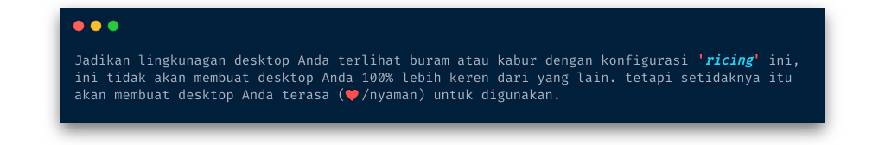

     
        
     

<h1 align='center'>
    <b>Ngeblur Desktop</b>
</h1>

    <i>Blur plus transparan menggambarkan <b><u>nuansa ketenangan</u></b>, kan? eh? (ah terserahlah)</i>

    
    
    
    

 

    <i>(<b>Current language:</b> :indonesia: Indonesia | <a href="../../README.md">Go back?</a>)</i>

**Disarankan:** lebih baik menggunakan instalasi baru, dan tanpa _lingkungan desktop_.

    
<b>Tampilkan detail sistem</b>

    <ul>
        <li><b>OS</b>: Arch Linux / Lainnya</li>
        <li><b>Shell</b>: (oh-my) zsh</li>
        <li><b>Windows Manager</b>: i3 (gaps-next)</li>
        <li><b>Kompositor</b>: compton (<i>AUR: <a href="https://aur.archlinux.org/packages/compton-tryone-git/">compton-tryone-git</a></i>)</li>
        <li><b>Bar Status</b>: polybar</li>
        <li><b>Skema Warna</b>: pywal (<i>AUR: <a href="https://aur.archlinux.org/packages/wpgtk-git/">wpgtk-git</a></i>)</li>
        <li><b>Terminal</b>: urxvt (<i>AUR: <a href="https://aur.archlinux.org/packages/rxvt-unicode-cvs-patched-wideglyphs/">rxvt-unicode-cvs-patched-wideglyphs</a></i>)</li>
        <li><b>Manajer File</b>: Nemo untuk GUI, Ranger untuk CLI</li>
        <li><b>Launcher</b>: Rofi</li>
        <li><b>Editor</b>: Vim, VSCode</li>
        <li><b>Browser</b>: Chromium</li>
        <li><b>Tema GTK</b>: (Bawaan <a href="https://aur.archlinux.org/packages/wpgtk-git/">wpgtk-git</a>: FlatColor)</li>
        <li><b>Tema Ikon</b>: (Bawaan <a href="https://aur.archlinux.org/packages/wpgtk-git/">wpgtk-git</a>: flattrcolor-dark)</li>
        <li><b>Wallpaper</b>: (Lihat di direktori: <a href="../../.wallpaper">.wallpaper/</a>)</li>
    </ul>

## Daftar Isi

+ [Apa itu Ricing?](#apa-itu-ricing)
+ [Sebelum melanjutkan!](#sebelum-melanjutkan)
+ [Fitur dan beberapa tangkapan layar](#fitur-dan-beberapa-tangkapan-layar)
+ [Persiapan](#persiapan)
  + [Prasyarat](#prasyarat)
  + [Ketergantungan](#ketergantungan)
  + [Font](#font)
  + [Instalasi](#instalasi)
+ [Topik Tingkat Lanjut](#topik-tingkat-lanjut)
  + [Copot pemasangan](#copot-pemasangan)
  + [Perlu dikonfigurasi](#perlu-dikonfigurasi)
  + [Keybinds](#keybinds)
  + [Tips / Catatan](#tips--catatan)
+ [Ucapan Terima Kasih](#ucapan-terima-kasih)
+ [Bagaimana saya bisa mendukung pengembang?](#bagaimana-saya-bisa-mendukung-pengembang)
+ [Lisensi](#lisensi)

## Apa itu Ricing?

[(Kembali ke atas)](#daftar-isi)

Ada beberapa pendapat tentang awal kata ricing, yang paling terkenal di antaranya dimulai dari kata "**Race Inspired Cosmetic Enhancement (_RICE_)**", sebuah kontes mempercantik mobil dengan menambahkan banyak aksesori tanpa peduli dengan mesin yang ada di akhir tidak akan membuat perbedaan yang berarti kecuali hanya dari penampilan. Pada akhirnya, ***Membuat perbaikan pada sistem yang tidak benar-benar bermanfaat bagi siapa pun, dan kadang-kadang dapat memiliki konsekuensi negatif/positif.***

> **Ringkasan**: Inti dari ricing adalah mengubah tampilan sedemikian rupa untuk menemukan kenyamanan dalam menggunakan linux sebagai alat kerja sehari-hari. terkadang lebih sederhana lebih baik untuk kinerja sebaliknya, banyak dekorasi akan memperlambat kinerja

Oke, itulah penjelasan singkat tentang definisi **'_ricing_'**, semoga Anda mengerti pada saat ini, jika penjelasan singkat di atas tidak cukup untuk dipahami, silakan temukan detail lebih lanjut di internet

## Sebelum melanjutkan!

[(Kembali ke atas)](#daftar-isi)

***Saya ingin menekankan di sini agar tidak ada kesalahpahaman lebih lanjut***, ada <u>beberapa konfigurasi dan <b>'<i>ricing</i>'</b> yang tidak sepenuhnya dibuat oleh saya</u> tetapi dibuat oleh orang lain. yang saya lakukan hanyalah memodifikasinya agar sesuai dengan yang saya inginkan, sisanya dibuat oleh saya sendiri.

Jadi saya akan menempatkan [Ucapan Terima Kasih](#ucapan-terima-kasih) atas karya orang lain di bawah ini bersama dengan tautan sumber sebagai simbol untuk menghargai karya orang lain.

Jika ada karya Anda yang tidak tercantumkan di [Ucapan Terima Kasih](#ucapan-terima-kasih), saya minta maaf sebesar-besarnya kemungkinan karena saya kelupaaan atau saya tidak menemukan sumber aslinya. itu saja

## Fitur dan beberapa tangkapan layar

[(Kembali ke atas)](#daftar-isi)

+ Terminal berfitur lengkap dengan cuaca, warna, sinyal wifi, dan banyak lagi
+ Polybar dengan pemantauan sistem (CPU, RAM, Suhu, USB flashdrive), pemantauan jaringan (koneksi aktif, kecepatan transfer), dan banyak lagi
+ Baterai Monitor (ini memberi tahu ketika baterai lemah/penuh, dan adaptor dicolokkan/dicabut)
+ Volume/Kecerahan Notifier (ini memberi tahu ketika nilai berubah)
+ Terminal Notifier (ini memberi tahu ketika tugas telah selesai dijalankan dalam jangka waktu yang lama)
+ App, Emoji, Layout i3, Pemutar Musik, Jaringan, Kontrol Daya, Screenshot, dan laci peluncur VPN
+ Otomatis menghasilkan skemawarna berdasarkan wallpaper, dengan [wpgtk](https://github.com/deviantfero/wpgtk)
+ Efek suara opsional yang dibuat oleh perancang suara berbakat dari internet

| Desktop utama | Laci peluncur | Layar kunci |
| --- | --- | --- |
|  |  |  |

| Skemawarna dibuat secara otomatis | Draw terminal | dan Fitur lebih berguna |
| --- | --- | --- |
|  |  |  |

## Persiapan

[(Kembali ke atas)](#daftar-isi)

### Prasyarat

+ Sistem operasi mirip Unix: macOS, Linux, BSD. Di Windows: WSL lebih disukai, tapi mungkin itu tidak akan berhasil karena saya belum pernah mencobanya.
+ [Zsh](https://www.zsh.org) harus diinstal (v4.3.9 atau lebih baru). Jika belum diinstal (jalankan `zsh --version` untuk mengonfirmasi), periksa instruksi berikut di sini: [Menginstal ZSH](https://github.com/robbyrussell/oh-my-zsh/wiki/Installing-ZSH)
+ `git` harus dipasang
+ `curl` or `wget` harus dipasang
+ `yay` harus dipasang

### Ketergantungan

Berikut adalah daftar ketergantungan yang diperlukan untuk membuat **'_ricing_'** berfungsi sebagaimana mestinya. Jika Anda menginstal semuanya, Anda akan memiliki (sebagian besar) pengalaman smooth out of the box. Tentu saja, tidak semua dari mereka benar-benar melakukan sesuatu yang bermanfaat. (ini hanya untuk menyelesaikan apa yang dibutuhkan, untuk berjalan dengan benar)

Jika Anda melihat ada sesuatu yang hilang, harap buat 'issue' sehingga saya dapat menambahkan ketergantungan pada tabel ini.

| Ketergantungan | Deskripsi | Mengapa/Di mana itu dibutuhkan? |
| --- | --- | --- |
| `i3-gaps` (git `gaps-next` branch) | i3-gaps adalah fork dari i3wm, window manager ubin untuk X11 | (jelaskan sendiri) |
| `polybar` (git `master` branch) | Alat yang cepat dan mudah digunakan untuk membuat bilah status. | (jelaskan sendiri) |
| `dunst` | Daemon pemberitahuan yang ringan dan dapat disesuaikan | (jelaskan sendiri) |
| `rofi` | Pengalih jendela, peluncur aplikasi, dan penggantian dmenu | (jelaskan sendiri) |
| `rxvt-unicode` (aur `rxvt-unicode-cvs-patched-wideglyphs`) | Emulator terminal yang dapat dikustomisasi forked dari rxvt | (jelaskan sendiri) |
| `xorg-xbacklight` | Mendapat/Mengatur kecerahan layar | Kecerahaan keybinds |
| `lm_sensors` | Sensor suhu CPU | Widget suhu CPU |
| `upower` | Abstraksi untuk penghitungan perangkat daya, mendengarkan acara perangkat, dan lainnya | Widget baterai |
| `acpi` | Daemon untuk memberikan peristiwa ACPI | Pemberitahuan pengisi daya |
| `pulseaudio`, `libpulse` | Sistem suara **(Diinstal secara default di sebagian besar distro)** | Widget volume dan keybinds |
| `jq` | Mengurai output `json` | Widget cuaca |
| `fortune-mod` | Menampilkan kutipan acak (fortune cookies) | Widget fortune |
| `redshift` | Mengontrol suhu layar | Perintah mode malam |
| `mpd` | Aplikasi sisi server untuk memutar musik | Widget musik |
| `mpc` | Antarmuka baris perintah minimalis ke MPD | Widget musik |
| `scrot` | (SCReen shOT) adalah utilitas tangkapan layar commandline sederhana | Screenshot keybinds |
| `feh` | Penampil gambar dan setter wallpaper | Pratinjau tangkapan layar, wallpaper |
| [openweathermap](https://openweathermap.org/) key | Menyediakan data cuaca | Widget weather |
| **...** | **...** | **...** |

### Font

Anda dapat menggunakan font dari repo ini yang sudah diunduh, dapatkan dari [sini](../../.local/share/fonts).

#### Ikon

+ [Font Awesome](https://fontawesome.com/how-to-use/on-the-desktop/setup/getting-started)
+ [Weather Icons](https://erikflowers.github.io/weather-icons/)
+ [Nerd Fonts](https://github.com/ryanoasis/nerd-fonts)
  + [FiraCode](https://github.com/ryanoasis/nerd-fonts/tree/master/patched-fonts/FiraCode)
  + [Hack](https://github.com/ryanoasis/nerd-fonts/tree/master/patched-fonts/Hack)
  + [Hurmit](https://github.com/ryanoasis/nerd-fonts/tree/master/patched-fonts/Hermit)
  + [NotoSans](https://github.com/ryanoasis/nerd-fonts/tree/master/patched-fonts/Noto/Sans)
  + [RobotoMono](https://github.com/ryanoasis/nerd-fonts/tree/master/patched-fonts/RobotoMono)

#### Sans

+ [Abel](https://fonts.google.com/specimen/Abel)
+ [Comfortaa](https://fonts.google.com/specimen/Comfortaa)
+ [Noto Sans](https://fonts.google.com/specimen/Noto+Sans)
+ [San Francisco Pro Display](https://github.com/sahibjotsaggu/San-Francisco-Pro-Fonts)

### Instalasi

#### Instalasi dasar

(:pencil: _Belum diimplementasikan_)

#### Instalasi manual

(:pencil: _Belum diimplementasikan_)

## Topik Tingkat Lanjut

[(Kembali ke atas)](#daftar-isi)

### Copot pemasangan

(:pencil: _Belum diimplementasikan_)

### Perlu dikonfigurasi

(:pencil: _Belum diselesaikan_)

### Keybinds

(:pencil: _Belum diselesaikan_)

### Tips / Catatan

(:pencil: _Belum diselesaikan_)

## Ucapan Terima Kasih

[(Kembali ke atas)](#daftar-isi)

+ [vahnrr](https://gitlab.com/vahnrr) untuk `Rofi menus` [disini](https://gitlab.com/vahnrr/rofi-menus).
+ [kaustubhhiware](https://github.com/kaustubhhiware) untuk `NotiFyre` [disini](https://github.com/kaustubhhiware/NotiFyre).

## Bagaimana saya bisa mendukung pengembang?

[(Kembali ke atas)](#daftar-isi)

:star2: Beri bintang pada repo GitHub saya atau [mereka](#ucapan-terima-kasih). 
:wrench: Buat pull requests, submit bugs, sarankan fitur baru atau pembaruan dokumentasi

## Lisensi

[(Kembali ke atas)](#daftar-isi)

**Ngeblur Desktop** dilisensikan di bawah :scroll: GPLv3, Lihat [LICENSE](../../LICENSE) untuk informasi lebih lanjut.

---

***(Dokumentasi masih belum lengkap, akan diselesai nanti)*** - Ditulis pada Jumat, 29 Nov 2019
